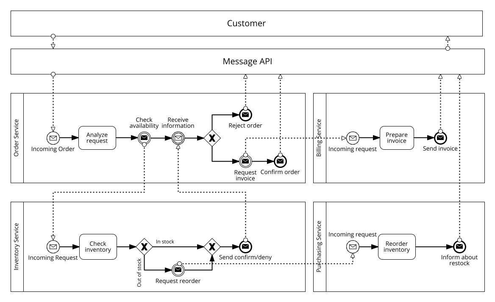
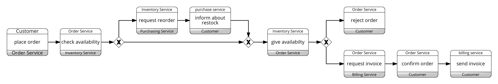

<div align="center">

# Service Oriented Process Simulation

[](https://github.com/pre-commit/pre-commit)

A supplementary project for the thesis *"Profile-based Anomaly Detection in Service Oriented Business Processes"*, for the simulation of a webshop microservice system.
</div>

<br>

## Description

The simulated system aims to mimic a webshop system consisting of individual services. Each service is responsible for a specific domain in the ordering process.  
Purpose is to generate a log of the underlying workflow of the system. This log containing the data transferred in the communication between services. Following figure illustrates the implemented system:


 
 Given this system, an order results in the following process choreography:
 

## Quickstart
### setup the project
```bash
# clone project
git clone https://github.com/nico-ru/so-process-simulation.git
cd so-process-simulation

# [OPTIONAL] create conda environment
conda create -n myenv python=3.10
conda activate myenv

# [OPTIONAL] install graphviz executables
# https://graphviz.org/download/

# install requirements
pip install -r requirements.txt

# setup and install package
python setup.py install
pip install .

# setup .env file according to env.example
cp env.example .env
sed -i "s|<base_dir>|$(pwd)|" .env   # note: if there is a | character in your path chage the delimiter

# or edit with your preferred editor
vim .env # --> edit path variable
```

### run the simulation
```bash
# start the services
/bin/bash scripts/start_services.sh

# start simulation
python run_simulation.py --n_requests 100
```

## Logs
The logs of the system are saved individually for each of the services. This includes the process event log in a csv format as well as the corresponding messages transferred between services. In order to merge the logs of the process choreography use:

```bash
python merge_logs.py
```

### Service Compounds
In case only the communication bewteen a certain subset of services (i.e. service compound) needs to be analyzed, the logs of only these can be merged as follows:
```bash
# merge only order and inventory logs
python merge_logs.py --services order inventory
```

### Export with messages
```bash
python export_logs.py

# export for only order and inventory services
python merge_logs.py --services order inventory
```
